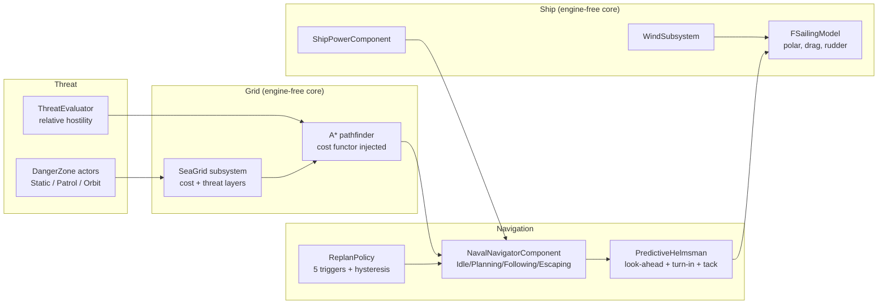

# Naval Navigation Sample

**Threat-aware navigation for physically-driven sailing ships — Unreal Engine 5.5, C++.**

A clean-room portfolio sample by [Kaan Altay](https://github.com/kaan1altay), exploring the ideas behind a navigation system I originally built for *[Grog 'n Glory](https://store.steampowered.com/app/2835500/Grog_n_Glory/)*, a co-op open-world pirate action-adventure. Everything here was written from scratch for this repo.


*Same start, same goal, different power: the weak ship routes around the zone, the strong one sails through it.*

---

## Why not just use a NavMesh?

Stock UE navigation assumes an agent that can stop, pivot in place, and follow a polyline exactly. A sailing ship can do none of that: it is driven by **wind and rudder**, has real turning inertia, cannot sail into the wind at all, and can't even turn without way on. On top of that, the open sea here is covered by **danger zones of varying power** that move and change at runtime — and whether a zone is dangerous depends on *who is asking*.

So this sample builds the alternative:

- a **sea-grid cost field** instead of blocking volumes — threat is soft cost, not a wall,
- an **A\* planner that knows nothing about physics**, producing intent-level routes,
- a **predictive helmsman that owns the physics**, treating the path as intent rather than a rail,
- and an **event-driven replanning policy** that keeps routes honest as the world changes.

## The core ideas

### 1. Threat is relative, not absolute

Every danger zone has a **power level**; so does every ship.

```
hostile(ship, zone) := ship.power + threshold < zone.power
```

A hostile zone is a huge cost; a non-hostile one is merely expensive. The same map therefore produces different routes for different ships with **zero per-encounter scripting** — designers place a zone and set one number. When a ship is fully enclosed by hostile zones it doesn't freeze: it degrades gracefully and exits through the **lowest-power zone** on the boundary (the least-bad way out).

### 2. Planner / helmsman split

The A\* planner (8-neighbour, octile heuristic, injectable cost functor, cost-aware string-pulling that refuses to shortcut back through danger) is engine-free and physics-agnostic. The **predictive helmsman** turns its waypoints into rudder and sail-trim commands:

- steers at a **speed-scaled look-ahead point** on the path,
- computes a **turn-in distance** (`R·tan(θ/2)` from the ship's turning circle) and puts the helm over *before* the corner — the way a real helmsman does,
- **tacks** when the wanted course is inside the no-go cone, and recovers from being caught "in irons" at zero speed,
- eases trim for arrival without losing steerage way.


*Debug overlays: per-cell cost field, planned route, look-ahead and turn-in markers, live helm telemetry.*

### 3. A sailing model you can unit-test

The hull is a deliberately simple kinematic model (`FSailingModel`, plain struct, no engine types): thrust from a **wind polar curve** (zero in the no-go cone, peak on a beam reach), semi-implicit quadratic drag so terminal speed is `MaxSpeed·√drive` *by construction*, rudder response lag, speed-dependent steering authority. Simple enough to reason about, honest enough to make the AI read like a sailor.

### 4. Event-driven replanning with hysteresis

A route is invalidated when any of these fire: the ship is knocked **off-route** (grace-timed), the remaining path becomes **blocked for this ship's power**, a **zone moves or changes power** near the ship or its path, the **ship's own power changes**, or a periodic validity check catches drift. Replans never stop the ship — the new route is planned from the current position and spliced in. Hysteresis and an adopt-only-if-better rule prevent replan storms; the overlay shows honest `validations N / replans M` counters.


*A patrolling zone slides across the route → the navigator re-plans mid-voyage, without stopping.*


*Enclosure: surrounded by hostile zones, the ship exits through the weakest one, then resumes its goal.*


*Power drop: weakened mid-voyage (`P` key), the ship re-solves and avoids the zone it was about to cross.*

## Architecture



The navigation core (grid, pathfinder, sailing model, helmsman, replan policy) is **plain C++ with no engine dependencies**, wrapped by thin UE classes. That's what makes the test story below possible.

## Try it

Requirements: **UE 5.5**, Visual Studio 2022 (C++ game dev workload), Windows.

```powershell
git clone https://github.com/kaan1altay/naval-navigation-sample.git
# Build (or right-click the .uproject → Generate project files → build in VS):
& "C:\Program Files\Epic Games\UE_5.5\Engine\Build\BatchFiles\Build.bat" NavalNavSampleEditor Win64 Development -project="<path>\NavalNavSample.uproject" -waitmutex
```

Open `NavalNavSample.uproject` → **File → New Level → Empty Level** → **Play**. The demo GameMode spawns everything: sea, wind, fleet, danger zones, HUD.

| Key | Action |
|---|---|
| `5`–`9` | Demo scenarios: baseline · moving-zone replan · power contrast · enclosure escape · power drop |
| Left-click | Order the selected ship to a point |
| `Tab` | Cycle selected ship |
| `1` / `2` / `3` | Navigator / ship / grid-cost overlays |
| `←` `→` / `↑` `↓` | Rotate wind / change wind strength |
| `O` / `P` | Raise / lower selected ship's power |
| Mouse wheel | Zoom |

## Tests

**30 automation tests** run in-engine (`Automation RunTests NavalNav`), covering pathfinding (including an A\*-vs-Dijkstra optimality check on randomized threat fields), the sailing model (polar shape, bounded speed, no-turn-without-way, 10k-tick NaN soak), the helmsman (turn-in before the corner, no orbiting, missed-waypoint recovery, in-irons recovery, closed-loop zigzag arrival) and replanning/escape (grace timing, per-ship blocking, hysteresis under zone jitter, splice continuity, least-bad-exit selection).

The same engine-free scenarios also compile against a minimal shim (`Tools/AlgoSelfTest`) with clang — 600+ assertions, clean under ASan/UBSan — so the core algorithms are verifiable without Unreal installed.

## Scope / non-goals

Deliberate simplifications, documented rather than hidden: kinematic hull (no buoyancy/Chaos physics), simple single-edge tacking (no full VMG beating with laylines), planner stays wind-agnostic (wind-aware routing is future work), A\* re-solve rather than incremental D\*-Lite, single-player. See [`docs/STATUS.md`](docs/STATUS.md) for the full development log.

## License

MIT — see [LICENSE](LICENSE).